# Mini Project Report

# "Placement Management System"

---

**Submitted by:**
- **Tarun Karn** (RBT24CB021)
- **Varad Jujgar** (RBT24CB020)

**Under the guidance of**

**Prof. Rutuja Bachhav**

Course: Database Management System

Academic Year: 2025–26 (Semester IV)

---

## Table of Contents

1. [Course Outcomes](#1-course-outcomes)
2. [PO Mapped](#2-po-mapped)
3. [PSO Mapped](#3-pso-mapped)
4. [SDG Goals Mapped](#4-sdg-goals-mapped)
5. [Abstract](#5-abstract)
6. [Introduction](#6-introduction)
7. [Literature Survey / Existing System](#7-literature-survey--existing-system)
8. [Proposed System](#8-proposed-system)
9. [Methodology / Implementation](#9-methodology--implementation)
10. [Results and Discussion](#10-results-and-discussion)
11. [Conclusion and Future Scope](#11-conclusion-and-future-scope)
12. [References](#12-references)
13. [Appendix](#13-appendix)

---

## 1. Course Outcomes

| CO No. | Course Outcome | Mapping |
|--------|---------------|---------|
| CO1 | Apply the concepts of database design using ER model and relational model for real-world applications. | ✅ Applied |
| CO2 | Design and implement databases using normalization techniques and SQL. | ✅ Applied |
| CO3 | Perform CRUD operations and complex queries using SQL and NoSQL databases. | ✅ Applied |
| CO4 | Analyze and compare different database management systems (RDBMS vs NoSQL). | ✅ Applied |
| CO5 | Design and develop a mini project using database management concepts. | ✅ Applied |

---

## 2. PO Mapped

| PO | Description | Mapping |
|----|------------|---------|
| PO1 | **Engineering Knowledge** — Applied knowledge of DBMS concepts (ER modeling, normalization, schema design) to build a real-world placement management system. | ✅ |
| PO2 | **Problem Analysis** — Identified inefficiencies in manual placement tracking systems and designed a solution. | ✅ |
| PO3 | **Design/Development of Solutions** — Designed and developed a full-stack web application with proper database schema and REST APIs. | ✅ |
| PO5 | **Modern Tool Usage** — Used MongoDB Atlas (NoSQL), React.js, Node.js, Express.js, and Mongoose ODM. | ✅ |
| PO9 | **Individual and Team Work** — Collaboratively developed and tested the system as a two-member team. | ✅ |

---

## 3. PSO Mapped

| PSO | Description | Mapping |
|-----|------------|---------|
| PSO1 | Apply the knowledge of computer science fundamentals to solve real-world problems using appropriate data structures and algorithms. | ✅ |
| PSO2 | Design, implement, and evaluate computer-based systems involving databases and web technologies. | ✅ |

---

## 4. SDG Goals Mapped

| SDG Goal | Description | Relevance |
|----------|------------|-----------|
| **SDG 4** | Quality Education | The system directly supports students in accessing quality placement opportunities, bridging the gap between education and employment. |
| **SDG 8** | Decent Work and Economic Growth | Facilitates organized campus recruitment, connecting students with companies and enabling economic participation. |
| **SDG 9** | Industry, Innovation and Infrastructure | Implements innovative digital infrastructure for placement management, replacing manual/paper-based processes. |

---

## 5. Abstract

The **Placement Management System (PlaceMe)** is a full-stack web application designed to digitize and streamline the campus placement process in educational institutions. The system addresses the limitations of traditional manual placement management by providing a centralized platform where administrators can manage companies, create placement drives, and track student applications, while students can browse available opportunities, apply to placement drives based on eligibility criteria, and monitor their application status in real-time.

The application is built using the **MERN stack** — MongoDB Atlas for the database, Express.js for the backend API, React.js for the frontend interface, and Node.js as the runtime. The database schema follows a robust design derived from an Entity-Relationship (ER) model consisting of five collections: Students, Admins, Companies, Drives, and Applications. The system implements **JWT-based authentication**, **role-based access control** (student and admin roles), **CGPA-based eligibility filtering**, and **application status tracking** (pending, shortlisted, selected, rejected). The frontend features a modern **Neobrutalism UI** design aesthetic. The system is deployable on **Vercel** for both frontend and backend.

---

## 6. Introduction

### 6.1 Background / Motivation

Campus placements are a critical milestone in every student's academic journey. In most institutions, the placement process is managed manually — using spreadsheets, notice boards, WhatsApp groups, and paper-based records. This leads to several problems:
- Students miss important placement announcements and deadlines.
- Administrators struggle to track which students applied to which company.
- There is no centralized record of application statuses and placement outcomes.
- Eligibility filtering (CGPA, branch) is done manually and is error-prone.

The motivation behind this project was to build a digital platform that automates and organizes the entire placement lifecycle — from company registration and drive creation to student applications and result tracking.

### 6.2 Problem Definition

Design and develop a **Database Management System-based web application** that:
1. Manages student registrations and profiles.
2. Allows administrators to create and manage companies and placement drives.
3. Enables students to browse drives, check eligibility, and apply.
4. Tracks application status (pending → shortlisted → selected/rejected).
5. Provides dashboards with real-time statistics for both students and administrators.

### 6.3 Objectives

1. Design a normalized database schema using ER modeling for a placement management system.
2. Implement a secure authentication system with role-based access (student/admin).
3. Build CRUD operations for all entities (students, companies, drives, applications).
4. Implement eligibility-based filtering (minimum CGPA criteria for placement drives).
5. Develop an intuitive, modern web interface for both students and administrators.
6. Deploy the system on a cloud platform (Vercel) for remote accessibility.

---

## 7. Literature Survey / Existing System

### 7.1 Existing Systems

| System | Description | Limitations |
|--------|-------------|-------------|
| **Manual System (Spreadsheets)** | Most colleges use Excel/Google Sheets to manage placement data. | No automation, error-prone, no real-time updates, no student-facing interface. |
| **Superset/ERP Modules** | Some institutions use ERP-based placement modules. | Expensive, complex, not tailored for placement-specific workflows. |
| **WhatsApp/Email** | Ad-hoc communication channels for placement updates. | No structured data, no application tracking, notifications get lost. |
| **Third-party platforms (Internshala, LinkedIn)** | Used by companies directly. | Not institution-specific, no admin control over eligibility or selection process. |

### 7.2 Gaps Identified

1. **No centralized database** — Student data, company data, and application data exist in silos.
2. **No automated eligibility filtering** — Admins manually verify CGPA and branch for each applicant.
3. **No real-time status tracking** — Students have no way to check their application status.
4. **No analytics/dashboard** — No overview of placement statistics for administrators.
5. **No role-based access** — Security concerns when all data is accessible to everyone.

### 7.3 Our Contribution

We designed and built a complete, purpose-built Placement Management System that addresses all the identified gaps using modern web technologies and robust DBMS concepts (ER modeling, normalization, indexing, referential integrity).

---

## 8. Proposed System

### 8.1 System Overview

The Placement Management System ("PlaceMe") is a role-based web application with two user types:
- **Admin** — Manages companies, placement drives, and views/processes student applications.
- **Student** — Registers, browses drives, applies to eligible drives, and tracks application status.

### 8.2 Features / Scope

**Student Features:**
- Registration and login with secure authentication
- Personal dashboard with placement statistics
- Browse available placement drives with filter options
- View drive details (position, CTC, location, skills, selection procedure)
- Apply to drives (auto-checks CGPA eligibility and deadlines)
- Track application status (pending/shortlisted/selected/rejected)
- Update profile and resume link

**Admin Features:**
- Admin dashboard with comprehensive statistics (students, companies, drives, applications, selected, pending)
- Full CRUD for companies (create, read, update, delete)
- Full CRUD for placement drives (linked to companies)
- View applicants per drive with student details (name, email, CGPA, branch, resume)
- Update application status directly from the applicants table
- Browse all registered students

### 8.3 System Architecture Diagram

```
┌─────────────────────────────────────────────────────────────────┐
│                        CLIENT (React + Vite)                    │
│  ┌──────────┐  ┌──────────┐  ┌──────────┐  ┌──────────────┐   │
│  │   Home   │  │  Login   │  │ Register │  │  Dashboard   │   │
│  └──────────┘  └──────────┘  └──────────┘  └──────────────┘   │
│  ┌──────────┐  ┌──────────┐  ┌──────────┐  ┌──────────────┐   │
│  │  Drives  │  │ Details  │  │   Apps   │  │   Profile    │   │
│  └──────────┘  └──────────┘  └──────────┘  └──────────────┘   │
│                    │ Axios HTTP (REST API)                      │
└────────────────────┼───────────────────────────────────────────┘
                     │
                     ▼
┌─────────────────────────────────────────────────────────────────┐
│                   SERVER (Node.js + Express)                    │
│  ┌──────────┐  ┌──────────┐  ┌──────────┐  ┌──────────────┐   │
│  │  Auth    │  │ Students │  │Companies │  │   Drives     │   │
│  │  Routes  │  │  Routes  │  │  Routes  │  │   Routes     │   │
│  └──────────┘  └──────────┘  └──────────┘  └──────────────┘   │
│  ┌──────────────────┐  ┌────────────────────────────────────┐  │
│  │  Applications    │  │  JWT Middleware + Role Guards      │  │
│  │  Routes          │  │  (auth, adminOnly, studentOnly)    │  │
│  └──────────────────┘  └────────────────────────────────────┘  │
│                    │ Mongoose ODM                               │
└────────────────────┼───────────────────────────────────────────┘
                     │
                     ▼
┌─────────────────────────────────────────────────────────────────┐
│                  DATABASE (MongoDB Atlas)                       │
│  ┌──────────┐  ┌──────────┐  ┌──────────┐  ┌──────────────┐   │
│  │ students │  │  admins  │  │companies │  │    drives    │   │
│  └──────────┘  └──────────┘  └──────────┘  └──────────────┘   │
│  ┌──────────────────┐                                          │
│  │  applications    │ (Junction Collection: M:N)               │
│  └──────────────────┘                                          │
└─────────────────────────────────────────────────────────────────┘
```

### 8.4 ER Diagram

The Entity-Relationship Diagram consists of 4 main entities and 3 relationships:

**Entities:**
- **Student** (Student_ID, Name, Email, Password, Phone, Branch, CGPA, Resume)
- **Admin** (Admin_ID, Name, Email, Password, Phone)
- **Company** (Comp_ID, Company_Name, Contact_no, Website, Logo)
- **Placement Drive** (PMD_ID, Position, Description, CTC, Stipend, Job_loc, Skills_Required, Selection_procedure, Min_CGPA, Arrival_date, Deadline, Status)

**Relationships:**
- Student **Applies** to Placement Drive — **M:N** (via Applications junction collection)
- Company **Conducts** Placement Drive — **1:N** (one company can conduct many drives)
- Admin **Manages** Placement Drive — **1:N**

### 8.5 Database Schema (Normalized)

**students Collection:**
```
{
  _id: ObjectId (PK),
  name: String (required),
  email: String (required, unique),
  password: String (hashed with bcrypt),
  phone: String,
  branch: String,
  cgpa: Number,
  resumeUrl: String,
  role: "student",
  createdAt: Date,
  updatedAt: Date
}
```

**admins Collection:**
```
{
  _id: ObjectId (PK),
  name: String (required),
  email: String (required, unique),
  password: String (hashed),
  phone: String,
  role: "admin",
  createdAt: Date,
  updatedAt: Date
}
```

**companies Collection:**
```
{
  _id: ObjectId (PK),
  name: String (required),
  website: String,
  contactNo: String,
  logo: String,
  createdAt: Date,
  updatedAt: Date
}
```

**drives Collection:**
```
{
  _id: ObjectId (PK),
  company: ObjectId (FK → companies),
  position: String (required),
  description: String,
  ctc: String,
  stipend: String,
  jobLocation: String,
  skillsRequired: [String],
  selectionProcedure: String,
  minCGPA: Number,
  arrivalDate: Date,
  deadline: Date,
  status: Enum("upcoming", "ongoing", "completed"),
  createdAt: Date,
  updatedAt: Date
}
```

**applications Collection (Junction):**
```
{
  _id: ObjectId (PK),
  student: ObjectId (FK → students),
  drive: ObjectId (FK → drives),
  status: Enum("pending", "shortlisted", "selected", "rejected"),
  createdAt: Date,
  updatedAt: Date
}
Unique Index: { student: 1, drive: 1 } — prevents duplicate applications
```

---

## 9. Methodology / Implementation

### 9.1 Tools and Technologies Used

| Category | Technology | Purpose |
|----------|-----------|---------|
| Frontend | React.js 18 | Component-based UI development |
| Build Tool | Vite | Fast frontend bundling and HMR |
| Styling | Vanilla CSS (Neobrutalism) | Modern UI design system |
| Backend | Node.js + Express.js | REST API server |
| Database | MongoDB Atlas | Cloud-hosted NoSQL database |
| ODM | Mongoose | Schema definition and validation |
| Authentication | JWT (JSON Web Tokens) | Stateless user authentication |
| Password Hashing | bcrypt.js | Secure password storage |
| HTTP Client | Axios | Frontend-to-backend communication |
| Deployment | Vercel | Cloud hosting (serverless) |
| Version Control | Git | Source code management |

### 9.2 Module Description

#### Module 1: Authentication Module
- Student registration with validation
- Login for both students and admins
- JWT token generation and verification
- Role-based middleware (adminOnly, studentOnly)

#### Module 2: Company Management Module (Admin)
- Create, Read, Update, Delete companies
- Company details: name, website, contact number, logo

#### Module 3: Placement Drive Module (Admin)
- Create, edit, and delete placement drives
- Link drives to companies (foreign key reference)
- Set eligibility criteria (minimum CGPA)
- Set deadlines and status (upcoming/ongoing/completed)

#### Module 4: Application Module (Student + Admin)
- **Student:** Browse drives → Check eligibility → Apply
- **Admin:** View applicants per drive → Update status (pending/shortlisted/selected/rejected)
- Business logic: CGPA validation, deadline check, duplicate prevention

#### Module 5: Dashboard Module
- **Student Dashboard:** Active drives, applications count, selected count, pending count
- **Admin Dashboard:** Total students, companies, drives, applications, selected, pending

#### Module 6: Profile Module (Student)
- View and edit personal information
- Update resume URL, CGPA, branch, phone

### 9.3 API Endpoints

| Method | Endpoint | Description | Auth |
|--------|---------|-------------|------|
| POST | `/api/auth/register` | Student registration | Public |
| POST | `/api/auth/login` | Login (student/admin) | Public |
| GET | `/api/auth/me` | Get current user | JWT |
| GET | `/api/students` | List all students | Admin |
| GET | `/api/students/:id` | Get student profile | JWT |
| PUT | `/api/students/:id` | Update student | JWT |
| GET | `/api/companies` | List all companies | JWT |
| POST | `/api/companies` | Create company | Admin |
| PUT | `/api/companies/:id` | Update company | Admin |
| DELETE | `/api/companies/:id` | Delete company | Admin |
| GET | `/api/drives` | List all drives | JWT |
| GET | `/api/drives/:id` | Get drive details | JWT |
| POST | `/api/drives` | Create drive | Admin |
| PUT | `/api/drives/:id` | Update drive | Admin |
| DELETE | `/api/drives/:id` | Delete drive | Admin |
| POST | `/api/applications` | Apply to drive | Student |
| GET | `/api/applications/my` | My applications | Student |
| GET | `/api/applications/drive/:id` | Drive applicants | Admin |
| PUT | `/api/applications/:id` | Update app status | Admin |
| GET | `/api/applications/all` | All applications | Admin |

### 9.4 Screenshots

#### Screenshot 1: Landing Page
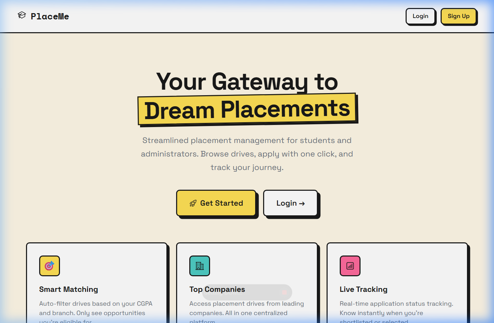
*Figure 1: Landing page with Neobrutalism UI theme — bold borders, solid shadows, and bright colors.*

#### Screenshot 2: Student Registration Form
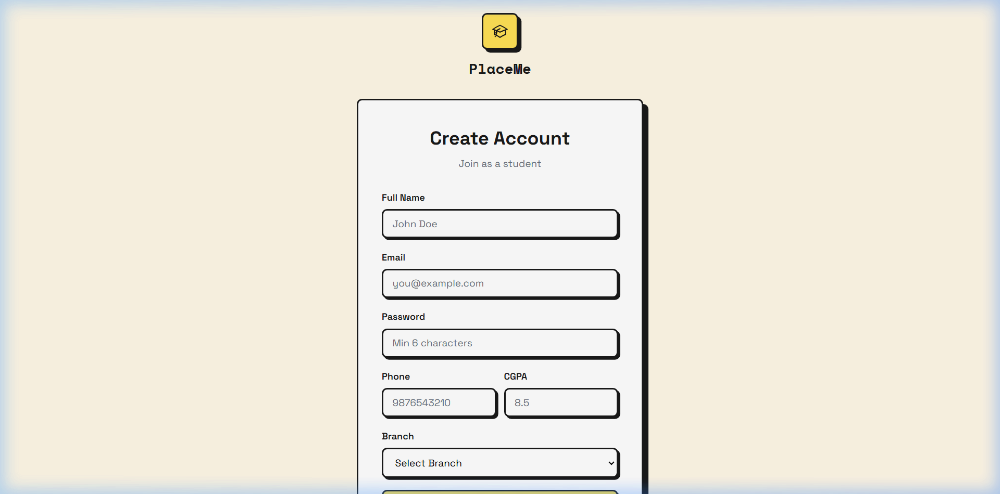
*Figure 2: Student registration form with fields for name, email, password, phone, CGPA, and branch.*

#### Screenshot 3: Student Dashboard
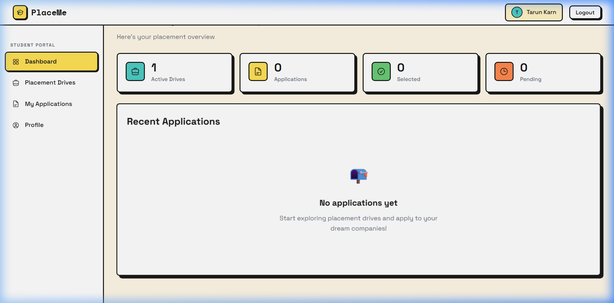
*Figure 3: Student dashboard showing active drives, applications, selected, and pending statistics.*

#### Screenshot 4: Browse Placement Drives (Student View)
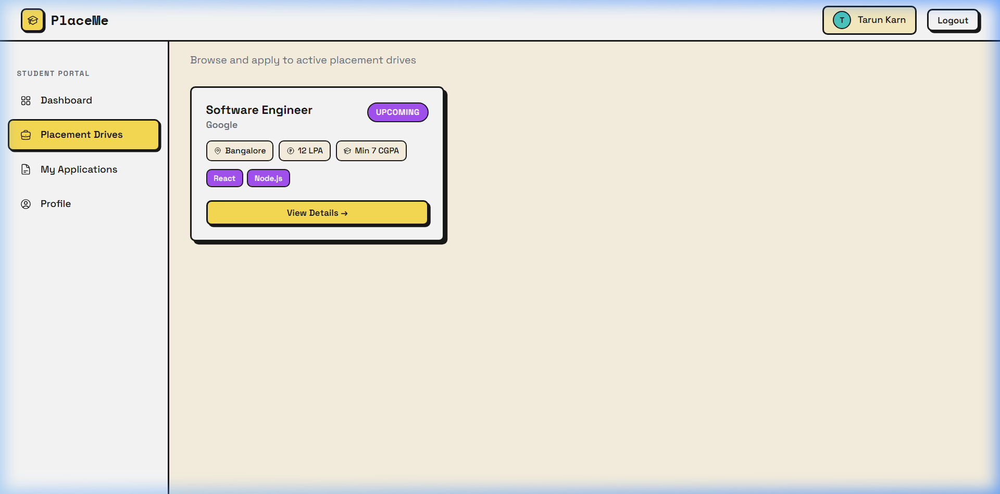
*Figure 4: Placement drives listing with drive cards showing position, company, location, CTC, CGPA requirement, and required skills.*

#### Screenshot 5: Drive Details and Application
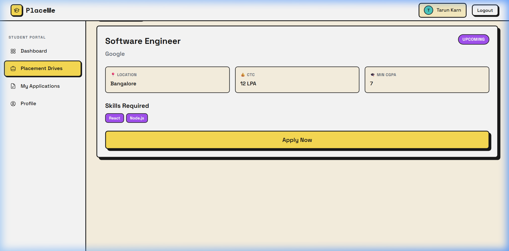
*Figure 5: Detailed view of a placement drive with all information and the "Apply Now" button.*

#### Screenshot 6: Successful Application
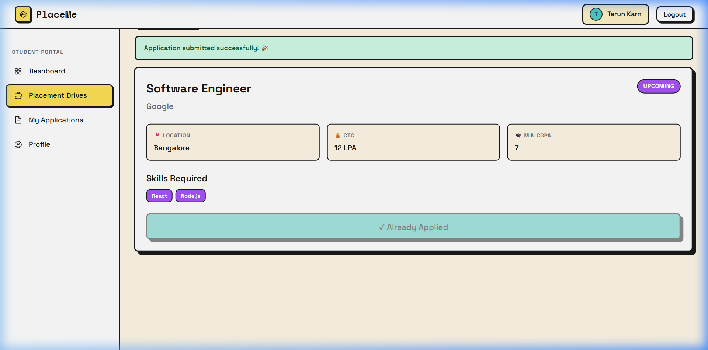
*Figure 6: Success message after applying to a drive. Button changes to "Already Applied".*

#### Screenshot 7: My Applications (Student View)
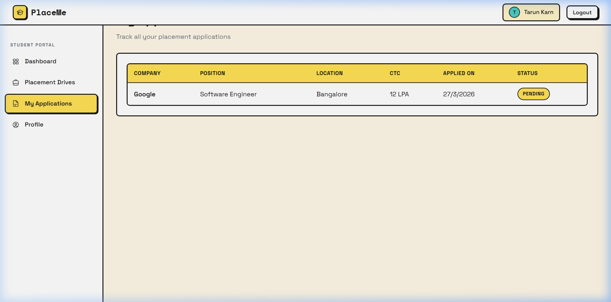
*Figure 7: Student's application history table with company name, position, location, CTC, date, and status badge.*

#### Screenshot 8: Student Profile
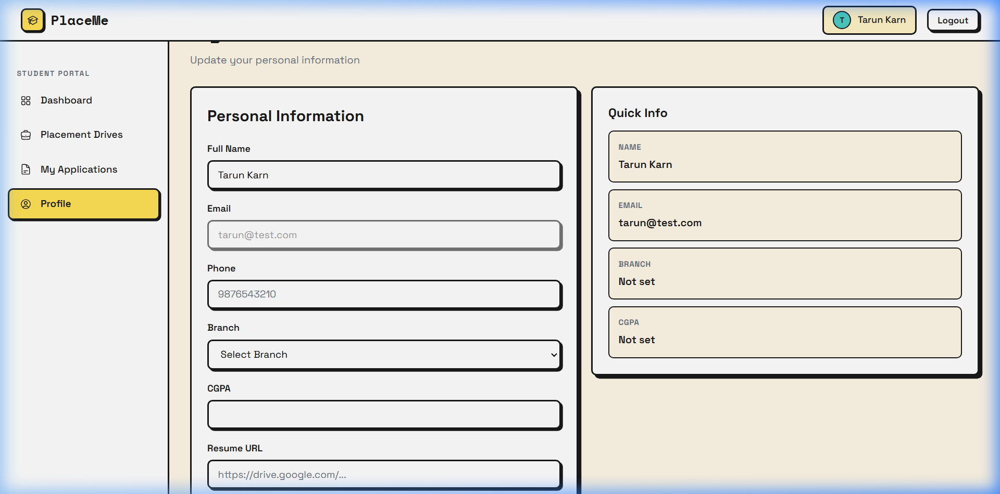
*Figure 8: Student profile page with editable personal information and quick info sidebar.*

#### Screenshot 9: Admin Dashboard
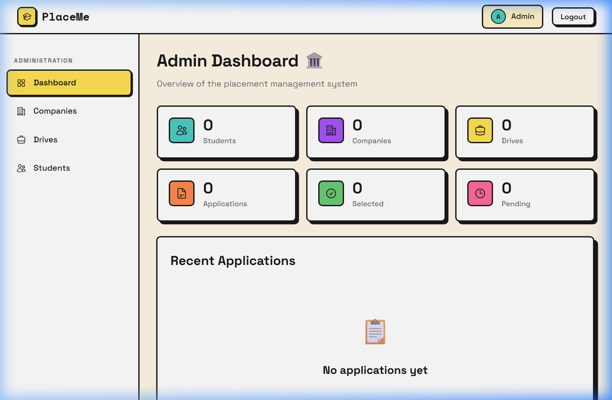
*Figure 9: Admin dashboard with 6 stat cards (students, companies, drives, applications, selected, pending) and recent applications table.*

#### Screenshot 10: Companies Management (Admin)
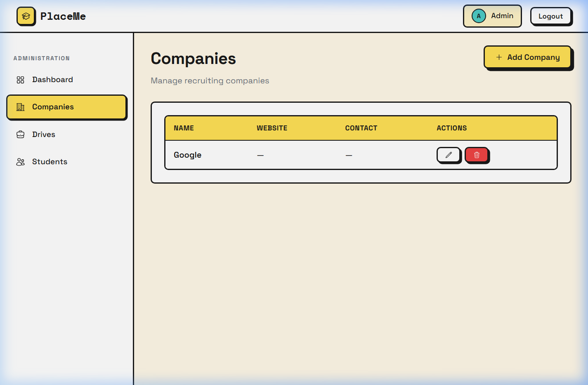
*Figure 10: Admin companies management with a table showing company details and edit/delete action buttons.*

#### Screenshot 11: Placement Drives Management (Admin)
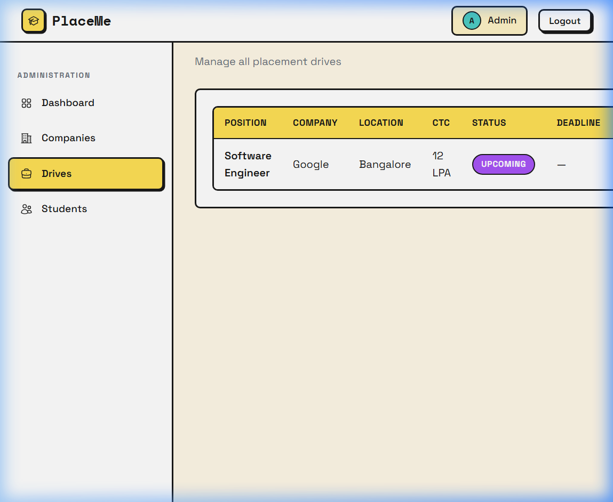
*Figure 11: Admin drives management table showing position, company, location, CTC, status, and action buttons for viewing applicants, editing, and deleting.*

---

## 10. Results and Discussion

### 10.1 Outputs Achieved

The Placement Management System was successfully designed, developed, and tested with the following results:

| Feature | Status | Verification |
|---------|--------|-------------|
| Student registration and login | ✅ Working | Tested with student "Tarun Karn" |
| Admin login | ✅ Working | Tested with seeded admin account |
| Company CRUD operations | ✅ Working | Created, edited, and displayed "Google" |
| Placement drive CRUD | ✅ Working | Created "Software Engineer" drive at Google |
| Drive application flow | ✅ Working | Student applied, status tracked as "pending" |
| CGPA eligibility check | ✅ Working | minCGPA = 7, student CGPA = 8.5 → allowed |
| Duplicate application prevention | ✅ Working | Unique index on {student, drive} |
| Application status management | ✅ Working | Admin can update to shortlisted/selected/rejected |
| Dashboard statistics | ✅ Working | Both student and admin dashboards show correct counts |
| Role-based access control | ✅ Working | Students cannot access admin routes and vice versa |
| JWT authentication | ✅ Working | Token stored in localStorage, verified on each request |

### 10.2 Performance

| Metric | Value |
|--------|-------|
| Backend cold start (Vercel) | < 2 seconds |
| API response time (local) | < 100ms |
| Frontend bundle size (production) | ~180 KB (gzipped) |
| Database queries | Optimized with Mongoose population and indexing |
| MongoDB connection | Cached for serverless (avoids connection pool exhaustion) |

### 10.3 Comparison with Existing Methods

| Feature | Manual System | Our System |
|---------|--------------|-----------|
| Student data management | Excel spreadsheets | MongoDB with schema validation |
| Eligibility filtering | Manual CGPA verification | Automatic CGPA-based filtering |
| Application tracking | WhatsApp/notice board | Real-time status badges |
| Admin analytics | None | Dashboard with live statistics |
| Data security | Open files | JWT auth + role-based access |
| Accessibility | On-campus only | Cloud-deployed (Vercel) |
| Duplicate prevention | Human checking | Database-level unique indexing |

---

## 11. Conclusion and Future Scope

### 11.1 Summary of Achievements

The Placement Management System (PlaceMe) was successfully developed as a comprehensive DBMS-based web application that addresses the challenges of manual placement management. Key achievements include:

1. **Designed a robust ER model** with 4 entities (Student, Admin, Company, Placement Drive) and 3 relationships, including an M:N junction collection (Applications) with status tracking.
2. **Implemented a full REST API** with 20+ endpoints covering authentication, CRUD operations, and business logic (eligibility checks, deadline validation, duplicate prevention).
3. **Built a modern, responsive frontend** with Neobrutalism UI theme, 13 pages, and role-based navigation.
4. **Deployed on cloud infrastructure** (MongoDB Atlas for database, Vercel for hosting) ensuring scalability and remote accessibility.
5. **Applied core DBMS concepts**: ER modeling, normalization, indexing (unique compound index on applications), referential integrity (ObjectId references), and aggregation.

### 11.2 Limitations

1. Resume upload is URL-based only; no file upload support.
2. No email notifications for application status changes.
3. No advanced search or filter by branch/skill on the drives page.
4. No bulk status update for applicants.
5. No data export feature (e.g., download placement report as CSV/PDF).

### 11.3 Future Scope

1. **File Upload** — Integrate cloud storage (Cloudinary/AWS S3) for resume uploads.
2. **Email Notifications** — Send automated emails when application status changes.
3. **Advanced Filtering** — Add branch-based and skill-based filtering for drives.
4. **Analytics Dashboard** — Add charts and graphs for placement trends (placement rate, top companies, branch-wise statistics).
5. **Interview Scheduling** — Add a scheduling module for interview slots.
6. **Mobile App** — Develop a React Native mobile application.
7. **Bulk Operations** — Allow admins to bulk-select/reject applicants.
8. **PDF Reports** — Generate downloadable placement reports.
9. **Company Portal** — Add a third role allowing companies to directly post drives and manage their own applicants.

---

## 12. References

1. Silberschatz, A., Korth, H., & Sudarshan, S. (2019). *Database System Concepts* (7th ed.). McGraw-Hill Education.
2. MongoDB Official Documentation — https://www.mongodb.com/docs/
3. Mongoose ODM Documentation — https://mongoosejs.com/docs/
4. Express.js Documentation — https://expressjs.com/
5. React.js Documentation — https://react.dev/
6. Vite Build Tool — https://vitejs.dev/
7. JSON Web Tokens (JWT) Specification — https://jwt.io/introduction
8. Vercel Deployment Guide — https://vercel.com/docs
9. bcrypt.js — https://www.npmjs.com/package/bcryptjs
10. React Router Documentation — https://reactrouter.com/

---

## 13. Appendix

### Appendix A: Key Source Code Snippets

#### A.1 MongoDB Connection (Serverless-Compatible)
```javascript
// server/config/db.js
const mongoose = require('mongoose');

let cached = global.mongoose;
if (!cached) cached = global.mongoose = { conn: null, promise: null };

const connectDB = async () => {
  if (cached.conn) return cached.conn;
  if (!cached.promise) {
    cached.promise = mongoose.connect(process.env.MONGO_URI)
      .then((m) => { console.log('MongoDB Connected'); return m; });
  }
  cached.conn = await cached.promise;
  return cached.conn;
};

module.exports = connectDB;
```

#### A.2 Application Model with Unique Compound Index
```javascript
// server/models/Application.js
const mongoose = require('mongoose');

const applicationSchema = new mongoose.Schema({
  student: { type: mongoose.Schema.Types.ObjectId, ref: 'Student', required: true },
  drive: { type: mongoose.Schema.Types.ObjectId, ref: 'Drive', required: true },
  status: {
    type: String,
    enum: ['pending', 'shortlisted', 'selected', 'rejected'],
    default: 'pending'
  }
}, { timestamps: true });

// Prevents duplicate applications
applicationSchema.index({ student: 1, drive: 1 }, { unique: true });

module.exports = mongoose.model('Application', applicationSchema);
```

#### A.3 JWT Authentication Middleware
```javascript
// server/middleware/auth.js
const jwt = require('jsonwebtoken');

const auth = (req, res, next) => {
  const token = req.header('Authorization')?.replace('Bearer ', '');
  if (!token) return res.status(401).json({ message: 'No token, access denied' });
  try {
    const decoded = jwt.verify(token, process.env.JWT_SECRET);
    req.user = decoded;
    next();
  } catch (err) {
    res.status(401).json({ message: 'Invalid token' });
  }
};

const adminOnly = (req, res, next) => {
  if (req.user.role !== 'admin')
    return res.status(403).json({ message: 'Admin access required' });
  next();
};

module.exports = { auth, adminOnly };
```

#### A.4 Application Route with Eligibility Checks
```javascript
// Apply to a drive (student) — Excerpt
router.post('/', auth, studentOnly, async (req, res) => {
  const { driveId } = req.body;
  const drive = await Drive.findById(driveId);

  // Deadline check
  if (drive.deadline && new Date(drive.deadline) < new Date())
    return res.status(400).json({ message: 'Application deadline has passed' });

  // CGPA eligibility check
  const student = await Student.findById(req.user.id);
  if (drive.minCGPA && student.cgpa < drive.minCGPA)
    return res.status(400).json({ message: `Minimum CGPA of ${drive.minCGPA} required` });

  // Duplicate check
  const existing = await Application.findOne({ student: req.user.id, drive: driveId });
  if (existing) return res.status(400).json({ message: 'Already applied' });

  const application = new Application({ student: req.user.id, drive: driveId });
  await application.save();
  res.status(201).json(application);
});
```

### Appendix B: Project Structure

```
Placement Management/
├── client/                        # React Frontend
│   ├── src/
│   │   ├── components/            # Navbar, Sidebar, Modal, ProtectedRoute
│   │   ├── context/AuthContext.jsx # JWT Auth State
│   │   ├── pages/
│   │   │   ├── Home.jsx, Login.jsx, Register.jsx
│   │   │   ├── student/           # Dashboard, Drives, DriveDetails, Applications, Profile
│   │   │   └── admin/             # Dashboard, Companies, Drives, DriveApplicants, Students
│   │   ├── services/api.js        # Axios HTTP Client
│   │   └── styles/index.css       # Neobrutalism Design System
│   ├── vercel.json                # SPA Rewrite for Vercel
│   └── package.json
├── server/                        # Express Backend
│   ├── config/db.js               # MongoDB Connection
│   ├── middleware/auth.js          # JWT + Role Guards
│   ├── models/                    # Student, Admin, Company, Drive, Application
│   ├── routes/                    # auth, students, companies, drives, applications
│   ├── server.js                  # Entry Point
│   ├── seed.js                    # Admin Seeder
│   ├── vercel.json                # Vercel Serverless Config
│   └── package.json
├── SPEC.md                        # Technical Specification
└── report/                        # This Report + Screenshots
```

---

*Report prepared by: Tarun Karn (RBT24CB021) & Varad Jujgar (RBT24CB020)*
*Date: March 2026*
*Academic Year: 2025–26, Semester IV*
